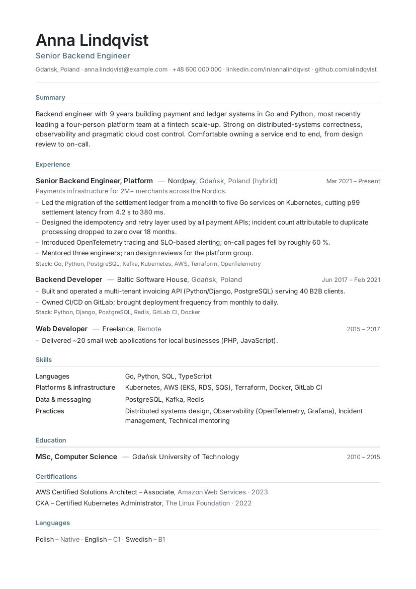
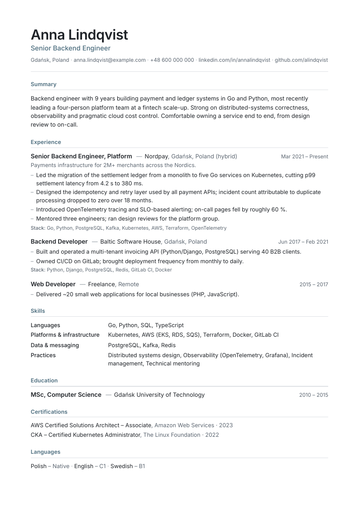

# Purple Squirrel

[](https://github.com/kradecki/purple-squirrel/releases/latest)
[](https://github.com/kradecki/purple-squirrel/actions/workflows/release.yml)
[](LICENSE)

A *purple squirrel* is recruiting slang for the mythical candidate who matches every requirement
of a job posting — so rare that finding one is like spotting a purple squirrel in the wild. This
project helps screening software see one in you, honestly: nothing invented, everything traceable
to your real record.

Inside is the **cv-designer** Claude skill: it turns a LinkedIn profile export into a tailored,
machine-readable CV as a single-column A4 PDF — plus a small Python pipeline you can run on its
own.



## How it works

1. **Extract** — reads a LinkedIn "Save to PDF" export, separates the sidebar (contact, skills,
   languages) from the main column, and drafts `cv-master.yaml` — the single source of truth the
   candidate keeps and hands back next time.
2. **Complete** — asks for what the export cannot contain (email, phone, profile URL) and flags any
   inconsistency the extractor spots (years claimed vs. dated roles, location mismatches).
3. **Tailor** — matches the master against a job posting (URL or pasted text) through a written
   protocol: requirements table → evidence map → strategy → rewrite. Every bullet traces back to
   the master; nothing is invented. Ships a `tailoring-report.md` with requirement coverage and an
   honest-gaps list.
4. **Render** — YAML through the chosen design's HTML/CSS template (see Designs) with headless
   Chromium: Inter embedded, A4, two pages max, optional photo, optional consent footer (Polish
   employers). Auto-fits density and warns about headlines and role headers that will wrap.
5. **Verify** — checks the PDF before delivery: page count, text layer, word integrity under
   pdfminer, standard section order, embedded fonts, metadata, no hidden/tiny/white text, link
   annotations, file size.

The designs are deliberately plain — nordic sets the tone: one typeface, one muted accent,
hairlines, whitespace. Machine readability drove choices you might not expect: no two-column
layout, mixed-case section headings (uppercase + tracking splits under pdfminer), no OpenType
numeral variants (they extract as private-use glyphs), and the *hinted* Inter build (the unhinted
web build makes pdfminer split words after every "t" in the 500/600 weights).

## Designs

Pick a look; every design passes the same machine-readability gate before it can merge.

| | |
|---|---|
|  | **nordic** — Scandinavian restraint: single muted accent, hairline rules, Inter, lots of air. The default. |

Choose it in conversation ("use the nordic design"), save it in your `cv-master.yaml`
(`design: nordic`), or pass `--design nordic` to the renderer.

### Create your own design

A design is one folder: `template.html` + `style.css` + `design.json` + `preview.png`. Four steps
(from `plugins/purple-squirrel/skills/cv-designer/`):

```bash
# 1. Copy the scaffold
cp -r designs/_template designs/my-design

# 2. Restyle — usually style.css alone; the scaffold's comments mark what must stay
$EDITOR designs/my-design/style.css

# 3. Test until every check passes
python scripts/render_cv.py --data assets/example-cv.yaml --out /tmp/my.pdf \
    --design designs/my-design --auto-fit --preview-dir /tmp/previews
python scripts/check_pdf.py --pdf /tmp/my.pdf --data assets/example-cv.yaml

# 4. Fill design.json, generate preview.png (commands in the guide), add yourself
#    to the gallery above, open a PR
```

The few hard rules — standard headings, rem sizing, the bundled Inter, no bars/pills/columns —
exist because screening software reads the PDF before a human does; the
[design authoring guide](plugins/purple-squirrel/skills/cv-designer/designs/_template/README.md)
explains each one. CI re-renders every design against the sample CV and blocks any PR that breaks
ATS extraction, so you can't ship a pretty-but-unparseable CV by accident.

## Installation

This repository is a Claude plugin marketplace — one install flow everywhere.

**Claude Code:**

```bash
claude plugin marketplace add kradecki/purple-squirrel
claude plugin install purple-squirrel@purple-squirrel
```

or in-session: `/plugin install purple-squirrel@purple-squirrel`.

**Claude.ai / Claude Desktop:** go to **Customize → Plugins → Add → Add marketplace**, enter
`kradecki/purple-squirrel`, then add the **Purple Squirrel** plugin. Enable *Sync automatically* to pick up
updates.

**Manual fallback:** download `cv-designer.zip` from the
[latest release](https://github.com/kradecki/purple-squirrel/releases/latest) and upload it at
**Customize → Skills**, or copy `plugins/purple-squirrel/skills/cv-designer/` into `~/.claude/skills/`.

Then say something like *"Here's my LinkedIn export and a job posting URL — make me a CV."*

## Running the pipeline without Claude

The scripts are plain Python and don't need the model; only the writing and tailoring steps do.

Setup (once):

```bash
pip install -r requirements.txt
python -m playwright install chromium
sudo apt install poppler-utils   # pdftoppm / pdffonts — on macOS: brew install poppler
```

Pipeline:

```bash
SKILL=plugins/purple-squirrel/skills/cv-designer

# 1. LinkedIn export → text + draft YAML
python $SKILL/scripts/extract_linkedin.py --pdf Profile.pdf --out-dir work/

# 2. Edit work/linkedin-draft.yaml into cv-master.yaml (schema: $SKILL/assets/example-cv.yaml)

# 3. Optional photo
python $SKILL/scripts/prepare_photo.py --in IMG_1234.jpg --out work/photo.jpg

# 4. Render
python $SKILL/scripts/render_cv.py --data cv-master.yaml --out work/My-Name-CV.pdf \
    --photo work/photo.jpg --auto-fit --preview-dir work/previews --design nordic

# 5. Check
python $SKILL/scripts/check_pdf.py --pdf work/My-Name-CV.pdf --data cv-master.yaml
```

`examples/` has a synthetic `sample-cv.yaml` and its rendered PDF.

## Repository layout

```
.claude-plugin/           marketplace.json — the repo is its own marketplace
plugins/purple-squirrel/      the plugin (.claude-plugin/plugin.json)
  skills/cv-designer/     the skill
    SKILL.md              workflow the model follows
    references/           tailoring protocol, writing rules, design spec
    scripts/              extract_linkedin.py, prepare_photo.py, render_cv.py, check_pdf.py
    designs/
      nordic/             default design (template.html, style.css, design.json, preview.png)
      _template/          design authoring guide + contract (README.md, template.html, style.css)
    assets/               example-cv.yaml, fonts/ (Inter, OFL)
    evals/evals.json      test prompts and assertions used during development
examples/                 synthetic sample: YAML → PDF → PNG
```

## Releases

Pushing a tag `vX.Y.Z` triggers CI, which builds `cv-designer.zip` and attaches it to a GitHub
release — the zip is never committed to the repository. Marketplace installs track the repo
directly; the release zip is the manual-upload fallback.

```bash
git tag vX.Y.Z && git push origin vX.Y.Z
```

## Evaluation

Developed with skill-creator's eval loop: three test cases (export + posting with photo; export
only; existing master + posting), each run with and without the skill. Final iteration: skill runs
passed 100% of 71 assertions, baseline 86%. The gap came from machine-readability (word integrity
under pdfminer, standard headings, no placeholders), the reusable master file, and the tailoring
report with honest gaps. Test inputs are a real person's data and are not in the repository.

## Contributing

Issues and pull requests welcome — see [CONTRIBUTING.md](CONTRIBUTING.md).

## License

MIT for the code and documentation. Inter is bundled under the SIL Open Font License 1.1
(`plugins/purple-squirrel/skills/cv-designer/assets/fonts/LICENSE-Inter.txt`).
